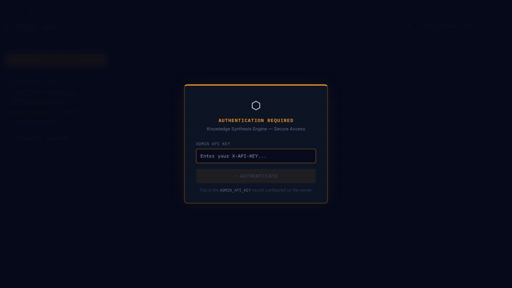

# Knowledge Synthesis Engine (KSE)
### The Autonomous Protocol for Global Knowledge Discovery and Semantic Integration

[]()
[]()
[]()

The **Knowledge Synthesis Engine (KSE)** is an enterprise-grade, multi-agent orchestration framework designed to identify latent connections within fragmented scientific datasets. By leveraging a content-addressable graph protocol (Semantic Mesh), KSE bridges conceptual gaps across disparate disciplines using a logical audit trail powered by xAI and Google DeepMind models.

---

## 🖥️ Interface Preview



> Observatory × Mission Control design language — deep navy `#06091a`, amber accents, IBM Plex Mono. The interactive 3D knowledge graph renders in-browser via WebGL / Three.js.

---

## ✨ Features

### 🔬 Knowledge Ingestion
- **ArXiv Scout** — trigger autonomous research cycles with a seed query; the engine fetches papers, extracts core concepts, and anchors them into the graph
- **File Ingestion** — drag-and-drop PDF, DOCX, TXT, or MD files, or paste raw text; concepts and cross-domain bridges are extracted automatically
- **Content-Addressable IDs (CIDs)** — every concept is assigned a cryptographic hash of its canonical name + domain, guaranteeing immutability and deduplication

### 🌐 Interactive 3D Knowledge Graph
- **Click** a node → detail panel slides in (CID, description, source link, connected proposals, trust scores)
- **Double-click** a node → pins it in 3D space (amber diamond marker); double-click again to release
- **Drag** one node close to another → merge proximity glow activates; release to trigger a merge confirmation overlay
- **Confirm merge** → backend combines both nodes and relinks all edges to the surviving node
- **Domain filter chips** (bottom-right HUD) → isolate or reveal per-domain clusters
- **Reset / Fit** buttons → reheat the simulation or zoom-to-fit all nodes
- **Expand** any node from its detail panel to fetch related concepts

### 🤖 Flexible AI Backend
| Role | Default Provider | Alternatives |
|---|---|---|
| Concept Extraction | Google Gemini | Ollama (local) |
| Cross-Domain Synthesis | OpenRouter (Llama 3.1) | Ollama (local) |
| Logical Audit | xAI Grok | Ollama (local) |

### 🏠 Local AI Support (Ollama)
Switch any pipeline stage to a local model — zero API costs, full privacy. Compatible with **Ollama**, **LM Studio**, **Jan**, and any OpenAI-compatible endpoint.

### 📋 Synthesis Proposals
- AI-generated hypotheses linking concepts from different domains
- Per-proposal trust score bars
- Approve / Reject validation workflow

---

## 🚀 Quick Start

### Prerequisites
- Node.js 18+
- API keys for Gemini, OpenRouter, and Grok (or a local Ollama instance)

### 1. Install dependencies
```bash
npm install
```

### 2. Configure secrets
Set the following environment variables (or Replit Secrets):

| Variable | Purpose |
|---|---|
| `ADMIN_API_KEY` | Password for the KSE login screen |
| `GEMINI_API_KEY` | Google Gemini — concept extraction |
| `OPENROUTER_API_KEY` | OpenRouter — cross-domain synthesis |
| `GROK_API_KEY` | xAI Grok — logical audit |
| `SESSION_SECRET` | Express session signing |

> If you prefer local models, set Ollama as the provider via **⚙ AI Config** in the UI — no cloud keys required for those stages.

### 3. Build and run
```bash
npm run build   # compiles backend (tsc) + frontend (vite)
npm run start   # serves on http://localhost:5000
```

Open `http://localhost:5000`, enter your `ADMIN_API_KEY`, and you're in.

---

## 🏛️ System Architecture

KSE operates on a **four-layer intelligence stack**:

1. **Ingestion Layer** — ArXiv adapter + file ingestion (PDF/DOCX/TXT/MD) with chunked text extraction
2. **Semantic Layer** — Content-Addressable Identifiers (CIDs) ensure every concept is immutable and unique
3. **Reasoning Layer** — Gemini extracts concepts → OpenRouter synthesises cross-domain hypotheses → Grok audits for logical soundness
4. **Visualization Layer** — `react-force-graph-3d` / Three.js 3D topological vector space with real-time interaction

See [docs/ARCHITECTURE.md](docs/ARCHITECTURE.md) for the full multi-agent orchestration deep-dive.

---

## 📡 API Reference

All endpoints require the `X-API-KEY` header matching `ADMIN_API_KEY`.

### Graph
| Method | Endpoint | Description |
|---|---|---|
| `GET` | `/api/v1/synthesis/graph` | Full graph — nodes, links, proposals, fileSources |
| `GET` | `/api/v1/graph/node/:id/expand` | Expand a node — fetch related concepts |
| `POST` | `/api/v1/graph/merge` | Merge two nodes `{ sourceId, targetId }` |
| `DELETE` | `/api/v1/graph/node/:id` | Delete a node and its edges |

### Ingestion
| Method | Endpoint | Description |
|---|---|---|
| `POST` | `/api/v1/scout/trigger` | Trigger an ArXiv scout cycle `{ seed_query? }` |
| `POST` | `/api/v1/ingest/file` | Upload a file (multipart, max 50 MB) — PDF, DOCX, TXT, MD |
| `POST` | `/api/v1/ingest/text` | Ingest raw text `{ title, content }` |

### Synthesis & Activity
| Method | Endpoint | Description |
|---|---|---|
| `GET` | `/api/v1/activity` | Last 50 activity log events |
| `POST` | `/api/v1/synthesis/:id/validate` | Vote on a proposal `{ approve, reasoning, expert_did }` |

### AI Configuration
| Method | Endpoint | Description |
|---|---|---|
| `GET` | `/api/v1/config` | Get current AI provider config |
| `POST` | `/api/v1/config` | Save AI provider config |
| `POST` | `/api/v1/config/test-ollama` | Test Ollama connection `{ endpoint, model }` |

Full schema and example payloads: [docs/API.md](docs/API.md)

---

## 🛠️ Tech Stack

| Layer | Technology |
|---|---|
| **Backend runtime** | Node.js / TypeScript / [Hono](https://hono.dev) |
| **Frontend** | React 18 / Vite |
| **3D Graph** | Three.js / react-force-graph-3d |
| **Styling** | Tailwind CSS / IBM Plex Mono + Inter |
| **AI — Extraction** | Google Gemini 1.5 Flash |
| **AI — Synthesis** | OpenRouter (Llama 3.1 70B) |
| **AI — Audit** | xAI Grok Beta |
| **Local AI** | Ollama (any model) |
| **File parsing** | pdf-parse / mammoth |
| **Persistence** | JSON file store (CID-addressed) |

---

## 📖 Documentation

| Doc | Contents |
|---|---|
| [RESEARCHER_GUIDE.md](RESEARCHER_GUIDE.md) | Scientific workflow — seeding, visualisation, synthesis, validation |
| [docs/ARCHITECTURE.md](docs/ARCHITECTURE.md) | Multi-agent orchestration, CID system, scalability path |
| [docs/API.md](docs/API.md) | Full API reference with example payloads |
| [docs/WIKI.md](docs/WIKI.md) | Semantic Mesh philosophy and protocol design |
| [docs/THE_MANIFESTO.md](docs/THE_MANIFESTO.md) | Vision and founding principles |

---

## 🤝 Contributing

See [CONTRIBUTING.md](CONTRIBUTING.md) for governance and contribution guidelines.
See [PRIVACY.md](PRIVACY.md) for the data and privacy policy.

---

© 2026 Semantic Mesh Protocol. Built for the future of decentralised knowledge.
