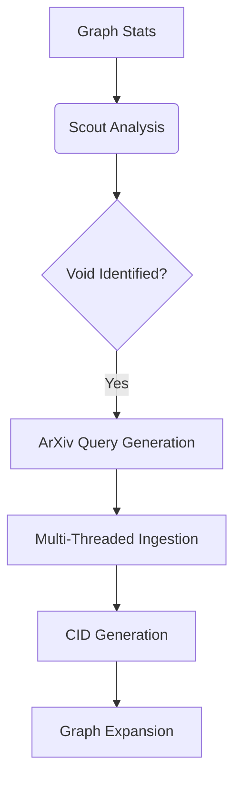

# Technical Architecture: Multi-Agent Orchestration

This document provides a deep dive into the internal mechanics of the Knowledge Synthesis Engine.

## 1. The Autonomous Scout Loop

The Scout agent (Grok-Beta) identifies "Research Voids" by analyzing the topological density of the graph.

## 2. Logical Audit Pipeline

Unlike standard RAG systems, KSE uses a **Reasoning Audit** to prevent hallucinations in scientific discovery.

*   **Generator (Gemini 1.5):** Synthesizes a hypothesis based on two distant nodes.
*   **Auditor (Grok):** Critically reviews the hypothesis against the raw source evidence stored in the CID.
*   **Result:** Only "Clean" audits are presented as valid connections in the 3D UI.

## 3. Data Persistence (CID)

KSE uses a Content-Addressable system. Every concept's ID is a cryptographic hash of its canonical name and domain. This ensures that:
1.  **Immutability:** Data cannot be modified once indexed.
2.  **Uniqueness:** No duplicate concepts can exist in the global mesh.
3.  **Traceability:** Every node points back to a verifiable source paper ID.

## 4. Scalability Path

Current persistence uses a structured JSON-L store for rapid local development. The architecture is "Database Agnostic" (using the Repository Pattern), allowing a 10-minute transition to PostgreSQL or Neo4j for enterprise-wide deployments.
